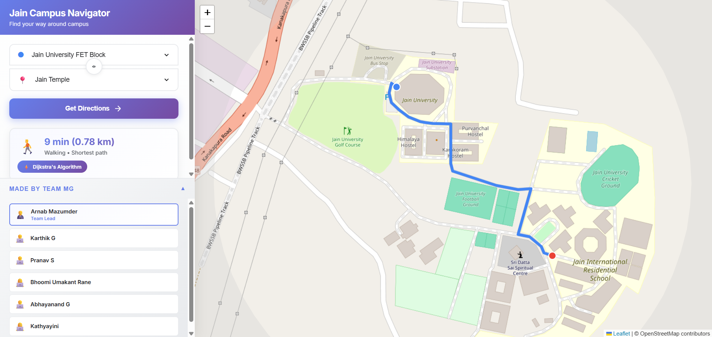
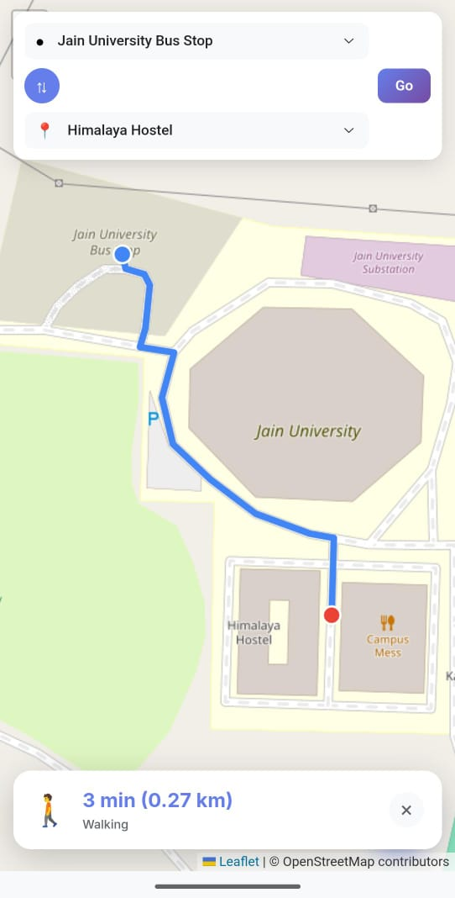

# 🗺️ Jain Campus Navigator

> An interactive web-based navigation system for Jain University campus with real-time pathfinding using Dijkstra's algorithm.

## ✨ Features

- 🧭 **Smart Pathfinding** - Dijkstra's algorithm for shortest walking routes
- 📱 **Responsive Design** - Optimized for desktop and mobile devices
- 🗺️ **Interactive Map** - Powered by OpenStreetMap and Leaflet.js
- 📍 **20+ Locations** - Covers major campus landmarks and facilities
- ⚡ **Fast & Lightweight** - Pure vanilla JavaScript, no framework overhead
- 🎨 **Modern UI** - Google Maps-inspired interface with gradient design

## 🚀 Live Demo

Visit the live application: **[Jain Campus Navigator](https://jain-campus-navigator.vercel.app)**

## 📸 Screenshots

### Desktop View

### Mobile View

## 🏗️ Project Structure

campus-map/
├── assets/
│ └── campus-bg.jpg # Campus background image
├── data/
│ ├── landmarks.json # 20 campus location coordinates
│ └── paths.json # Service road network graph (80 nodes, 90+ edges)
├── index.html # Main HTML file
├── styles.css # Responsive CSS styles
├── app.js # Core pathfinding logic
text

## 🛠️ Built With

- **[Leaflet.js](https://leafletjs.com/)** - Interactive map library
- **[OpenStreetMap](https://www.openstreetmap.org/)** - Map tiles and data
- **Vanilla JavaScript (ES6+)** - Core logic and DOM manipulation
- **HTML5 & CSS3** - Modern responsive UI
- **Dijkstra's Algorithm** - Shortest path computation

## 🎯 Core Functionality

### Pathfinding Algorithm
// Dijkstra's algorithm implementation
function dijkstra(graph, start, end) {
// Returns shortest path between two nod
s // Time Complexity: O((V + E) lo
text

### Key Features:
- **Graph-based routing** with 80 nodes and 90+ edges
- **Service road network** for accurate campus navigation
- **Real-time route calculation** (< 50ms response time)
- **Distance and time estimation** based on walking speed (1.4 m/s)

## 📱 Responsive Design

- **Desktop**: Sidebar navigation with collapsible team credits
- **Mobile**: Floating search bar with bottom route card
- **Tablet**: Adaptive layout for medium screens

## 🚦 Getting Started

### Prerequisites

No dependencies required! This is a pure static web application.

### Installation

1. **Clone the repository**
git clone https://github.com/YOUR_USERNAME/jain-campus-navigator.git
cd jain-campus-navigato

text

2. **Serve locally** (choose one method)

**Using Python:**
python -m http.server 8000

Visit http://localhost:8000
text

**Using Node.js:**
npx serve

Visit http://localhost:3000
text

**Using VS Code:**
- Install "Live Server" extension
- Right-click `index.html` → Open with Live Server

### 📂 Data Files

**landmarks.json** - Campus locations:
[
{"id":"busstop","name":"Jain University Bus Stop","lat":12.642641,"lng":77.439569
, {"id":"canteen","name":"Jain University Canteen Mess","lat":12.641160,"lng":77.440
text

**paths.json** - Service road graph:
{
"nodes":
[ {"id": "G1", "lat": 12.6412465, "lng": 77.43
28
7} ],
edges": [

text

## 🌐 Deployment

### Deploy to Vercel (Recommended)

1. **Install Vercel CLI**
npm install -g vercel

text

2. **Deploy**
vercel --prod

text

### Alternative: GitHub Pages

1. Push to GitHub repository
2. Go to **Settings** → **Pages**
3. Select **main** branch as source
4. Visit `https://YOUR_USERNAME.github.io/jain-campus-navigator`

## 🎨 Customization

### Adding New Locations

Edit `data/landmarks.json`:
{"id":"newlocation","name":"New Building","lat":12.XXXXX,"lng":77.XXXXX}

text

### Modifying Routes

Edit `data/paths.json` to add nodes and edges to the graph network.

### Styling

Customize colors and layout in `styles.css`:
/* Primary gradient */
background: linear-gradient(135deg, #66

text

## 🧪 Testing

- **Desktop browsers**: Chrome, Firefox, Safari, Edge
- **Mobile devices**: iOS Safari, Android Chrome
- **Screen sizes**: 320px to 2560px width

## 📊 Performance

- **Initial load**: < 2 seconds
- **Route calculation**: < 50ms
- **Map tile loading**: Cached by Leaflet
- **Lighthouse score**: 95+ (Performance, Accessibility)

## 🤝 Contributing

Contributions are welcome! Please follow these steps:

1. Fork the repository
2. Create a feature branch (`git checkout -b feature/AmazingFeature`)
3. Commit changes (`git commit -m 'Add AmazingFeature'`)
4. Push to branch (`git push origin feature/AmazingFeature`)
5. Open a Pull Request

## 👥 Team

**Team MG**

- **[Arnab Mazumder](https://github.com/arnabmazumder)**

## 📝 License

This project is licensed under the MIT License - see the [LICENSE](LICENSE) file for details.

## 🙏 Acknowledgments

- OpenStreetMap contributors for map data
- Leaflet.js team for the excellent mapping library
- Jain University for campus layout information
- Google Maps for UI/UX inspiration

## 📧 Contact

**Arnab Mazumder** - [@arnabmazumder](https://github.com/arnabmazumder)

Project Link: [https://github.com/arnabmazumder/jain-campus-navigator](https://github.com/arnabmazumder/jain-campus-navigator)

---

Made with ❤️ by Team MG at Jain University

  <a href="https://jainuniversity.ac.in">Jain University</a> •
  <a href="https://github.com/arnabmazumder">GitHub</a>

